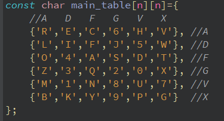

# Szyfr ADFGVX
Jest to szyfr podstawieniowo-przestawieniowym. W algorytmie używa się macierzy, która zawiera wszystkie możliwe litery alfabetu. Zaimplementowana wersja wykorzystuje macierz 6x6 co umożliwia kodowanie napisów, oraz cyfr. Występuje również wersja 5x5, gdzie nie ma cyfr, oraz litery 'i' oraz 'j' nie są rozróżnialne.

Kluczowa dla operacji podstawiania jest wcześniej wpomniana macierz, a dla przestawień ważne jest hasło, które definiuje nam kolejność odczytywanego kryptogramu.

Zawartość tablicy nie jest jednoznacznie zdefiniowana i na ogół jest losowa, można dobrowolnie wybrać sobię kolejność liter i cyfr w macierzy. Nazwa algorytmu pochodzi od liter w nagłówkach kolumn i wierszy. Służą one do szyfrowania i deszyfrowania tekstu jawnego.

Zaimplamentowana przeze mnie wersja wykorzystuje tablice zawierającą wielkie litery. W przypadku wpisania małych liter, te w trakcie przebiegu szyfrowania/deszyfrowania zostaną zamienione na wielkie.

   

## Proces szyfrowania
---
Pierwszym krokiem jest znalezienie każdej litery alfaberu z tekstu jawnego i zakodowanie go za pomocą nazw kolumn i wierszy. Pierwszą literą w zaimplementowanej wersji będzie ta wywodząca się od kolumny.

Następnie tworzona jest nowa macierz. Tym razem obiektem zainteresowania są tylko nazwy kolumn będące kolejnymi literami podanego klucza. Otrzymany w poprzednim kroku kryptogram wpisujemy wiersz po wierszu. Puste miejsca wypełnione zostaną znakiem '-'.

Następnie sortujemy litery z klucza w porządku rosnącym otrzumyjąc tym samym pewne przestawienie kolumnowe.

Wiadomość ostatecznie deszyfrujemy odczytując tekst kolumnami.